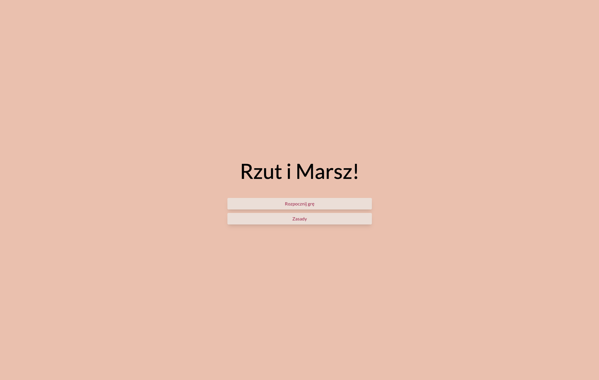
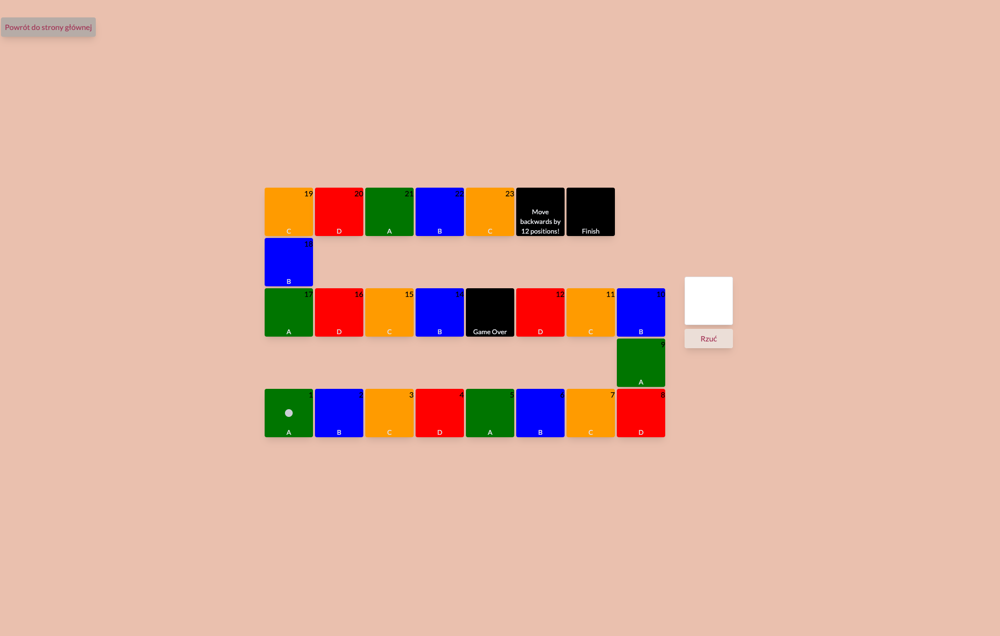
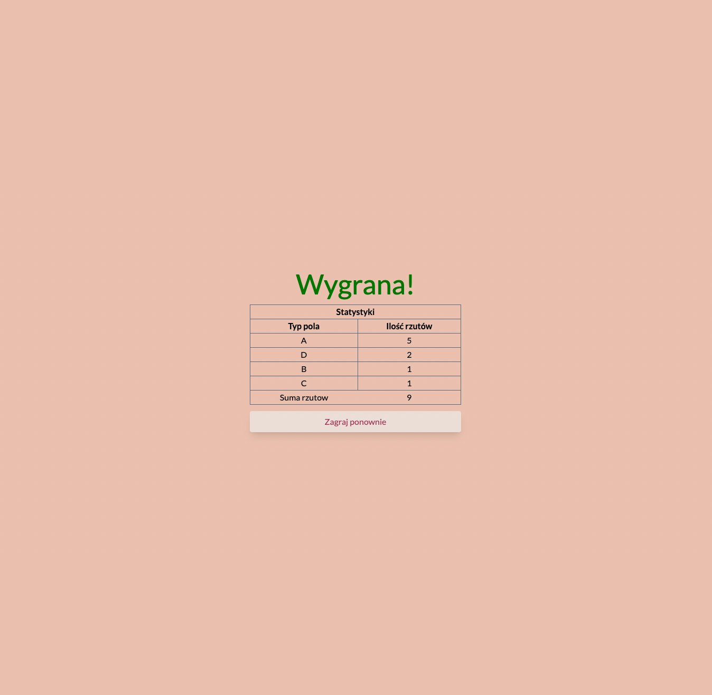
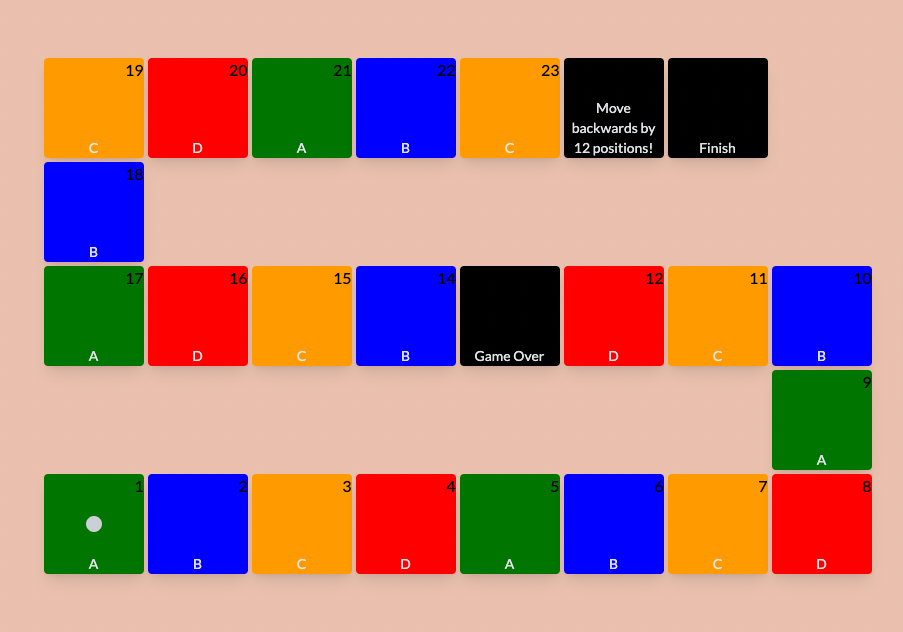
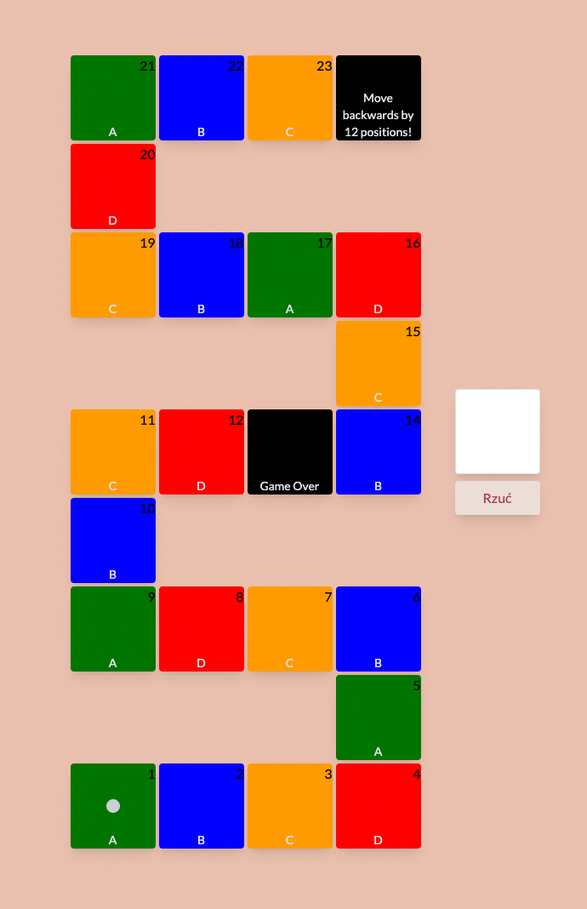
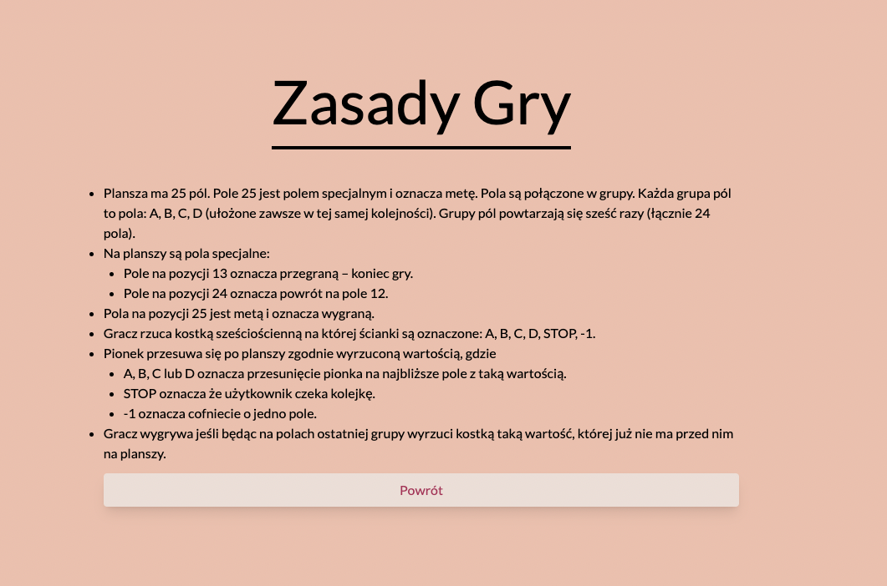

# O Projekcie

W ramach zadania rekrutacyjnego wykonałem aplikacje internetową symulującą grę planszową (roboczo
nazwaną Rzut i Marsz).

Plansza składa się z naprzemiennie z grup pól A, B, C oraz D. Na planszy znajdują się również pola
specjalane. Jeżeli pionek stanie na jednym z nich wykona się pewna akcja jak np. cofnięcie o wybraną
ilość pól, zakończenie gry poprzez wygraną lub przegraną itp. Gracz wygrywa jeśli będąc na polach
ostatniej grupy wyrzuci kostką taką wartość, której już nie ma przed nim na planszy lub stanie na
polu specjalnym z akcją zwycięstwa (meta). Po skończeniu rozgrywki pokazywany jest widok ze
statystykami rozgrywki.

Aby rozpocząć grę należy wciśnąć przycisk **Rozpocznij grę**. Po rozpoczęciu gry, aby losować
kostką, naciśnij przycisk **Rzuć**.

Aby zobaczyć zasady rozgrywki, należy wcisnąć przycisk **Zasady**

### Ekran powitalny



### Przykładowy ekran rozgrywki



### Przykładowy ekran statystyk



## Instalacja

Aby zainstalować i uruchomić projekt lokalnie, wykonaj następujące kroki:

1. Sklonowanie repozytorium

```bash
$ git clone <repository-url>
```

2. Instalacja pakietów

```bash
$ npm install
```

3. Uruchomienie aplikacji

```bash
$ npm run dev
```

## Uruchamianie testów

Żeby uruchomić testy należy użyć następującego polecenia:

```bash
$ npm run test
```

## Technologie

W Projekcie użyto następujących technologii:

- [React.js](https://react.dev/)
- [Typescript](https://www.typescriptlang.org/)
- [Tailwind CSS](https://tailwindcss.com/)
- [React Testing Library](https://testing-library.com/)
- [Jest](https://jestjs.io/)
- [Vite](https://vitejs.dev/)

## Konfiguracja

Konfiguracja gry jest pobierana z backendu. W skład konfiguracji wchodzi:

- łączna ilość pól
- ilość pól w rzędzie
- konfiguracja pól specjalnych
- instrukcja gry.

Na rzecz tego projektu, proces pobierania danych jest symulowany (patrz hook
`src/hooks/useGameConfig.ts`).

Przykładowa konfiguracja wygląda następująco:

```
{
  fieldsNumber: 25,
  fieldsPerRow: 8,
  specialFieldsConfig: {
    13: {
      label: 'Koniec gry!',
      action: 'gameOver',
    },
    24: {
      label: 'Cofasz się o 12 pól!',
      action: 'moveBackward',
      pieceOffset: 12,
    },
    25: {
      label: 'Meta',
      action: 'gameWon',
    },
  },
  gameRules: [
    {
      type: 'item',
      text: 'Plansza ma 25 pól. Pole 25 jest polem specjalnym i oznacza metę. Pola są połączone w grupy. Każda grupa pól to pola: A, B, C, D (ułożone zawsze w tej samej kolejności). Grupy pól powtarzają się sześć razy (łącznie 24 pola).',
    },
    {
      type: 'item',
      text: 'Na planszy są pola specjalne:',
      children: [
        {
          type: 'subitem',
          text: 'Pole na pozycji 13 oznacza przegraną – koniec gry.',
        },
        {
          type: 'subitem',
          text: 'Pole na pozycji 24 oznacza powrót na pole 12.',
        },
      ],
    },
    {
      type: 'item',
      text: 'Pola na pozycji 25 jest metą i oznacza wygraną.',
    },
    {
      type: 'item',
      text: 'Gracz rzuca kostką sześciościenną na której ścianki są oznaczone: A, B, C, D, STOP, -1.',
    },
    {
      type: 'item',
      text: 'Pionek przesuwa się po planszy zgodnie wyrzuconą wartością, gdzie',
      children: [
        {
          type: 'subitem',
          text: 'A, B, C lub D oznacza przesunięcie pionka na najbliższe pole z taką wartością.',
        },
        {
          type: 'subitem',
          text: 'STOP oznacza że użytkownik czeka kolejkę.',
        },
        {
          type: 'subitem',
          text: '-1 oznacza cofniecie o jedno pole.',
        },
      ],
    },
    {
      type: 'item',
      text: 'Gracz wygrywa jeśli będąc na polach ostatniej grupy wyrzuci kostką taką wartość, której już nie ma przed nim na planszy.',
    },
  ],
};
```

## Konfiguracja pól specjalnych

Aby dodać/edytować pola specjalne, należy dodać/edytowac obiekt **specialFieldsConfig** gdzie jako
klucz przekazujemy indeks pola, a jako wartość obiekt z następującymi polami:

- **label** - etykieta wyświetlana na polu
- **action** - nazwa akcji, jaka ma się zadziać po stanięciu na pole. Na ten moment obsługiwane są
  następujące akcje:
  - _gameWon_ - gra zostaje zakończona jako zwycięska
  - _gameOver_ - gra zostaje zakończona jako przegrana
  - _moveForward_ - pionek zostaje przesunięty do przodu o wartość zdefiniowaną w polu _pieceOffset_
  - _moveBackward_ - pionsek zostaje przesunięty do tyłu o wartość zdefiniowaną w polu _pieceOffset_
- **pieceOffset** - przesunięcie pionka

## Konfiguracja wyglądu planszy

Aby zmienić wygląd wygląd planszy nalezy zmodyfikować pola:

- **fieldsNumber** - łączna ilość pól,
- **fieldsPerRow** - ilość pól w rzędzie

Przykładowe wygląd dla planszy o wartościach

```
fieldsNumber: 25
fieldsPerRow: 8
```



Przykładowe wygląd dla planszy o wartościach

```
fieldsNumber: 25
fieldsPerRow: 4
```



## Konfiguracja instrukcji

Zeby skonfigurować instrukcję gry nalezy edytować pole **gameRules**. Jest to tablica obiektów.
Obiekt składa się z następujących pól:

- **text** - tekst jaki ma się wyrenderować
- **children** - parametr opcjonalny, jest to lista obiektów które posiadają pole **text**. W
  przypadku istnienie tego pola, renderowana jest zagniezdzona lista.

Przykładowy wygląd instrukcji.

```
[
    {
      text: 'Plansza ma 25 pól. Pole 25 jest polem specjalnym i oznacza metę. Pola są połączone w grupy. Każda grupa pól to pola: A, B, C, D (ułożone zawsze w tej samej kolejności). Grupy pól powtarzają się sześć razy (łącznie 24 pola).',
    },
    {
      text: 'Na planszy są pola specjalne:',
      children: [
        {
          text: 'Pole na pozycji 13 oznacza przegraną – koniec gry.',
        },
        {
          text: 'Pole na pozycji 24 oznacza powrót na pole 12.',
        },
      ],
    },
    {
      text: 'Pola na pozycji 25 jest metą i oznacza wygraną.',
    },
    {
      text: 'Gracz rzuca kostką sześciościenną na której ścianki są oznaczone: A, B, C, D, STOP, -1.',
    },
    {
      text: 'Pionek przesuwa się po planszy zgodnie wyrzuconą wartością, gdzie',
      children: [
        {
          text: 'A, B, C lub D oznacza przesunięcie pionka na najbliższe pole z taką wartością.',
        },
        {
          text: 'STOP oznacza że użytkownik czeka kolejkę.',
        },
        {
          text: '-1 oznacza cofniecie o jedno pole.',
        },
      ],
    },
    {
      text: 'Gracz wygrywa jeśli będąc na polach ostatniej grupy wyrzuci kostką taką wartość, której już nie ma przed nim na planszy.',
    },
  ],
```


